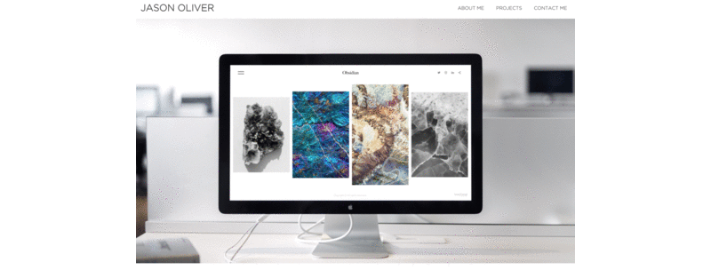
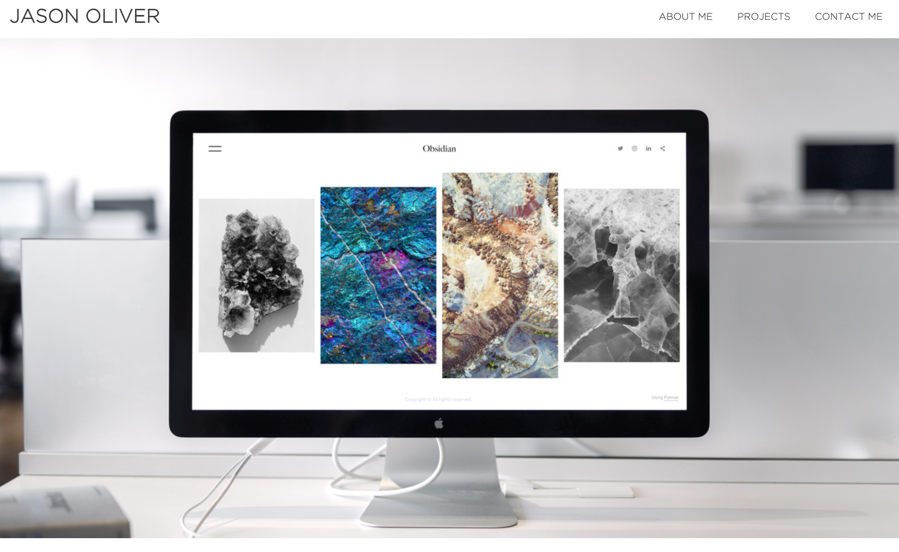
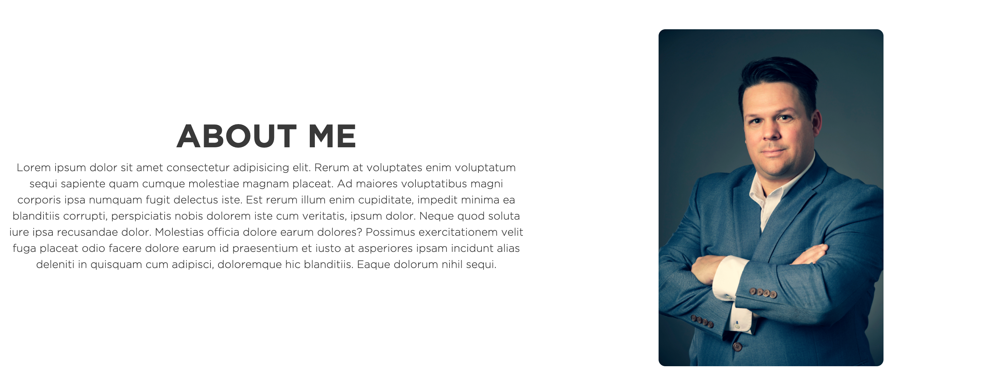
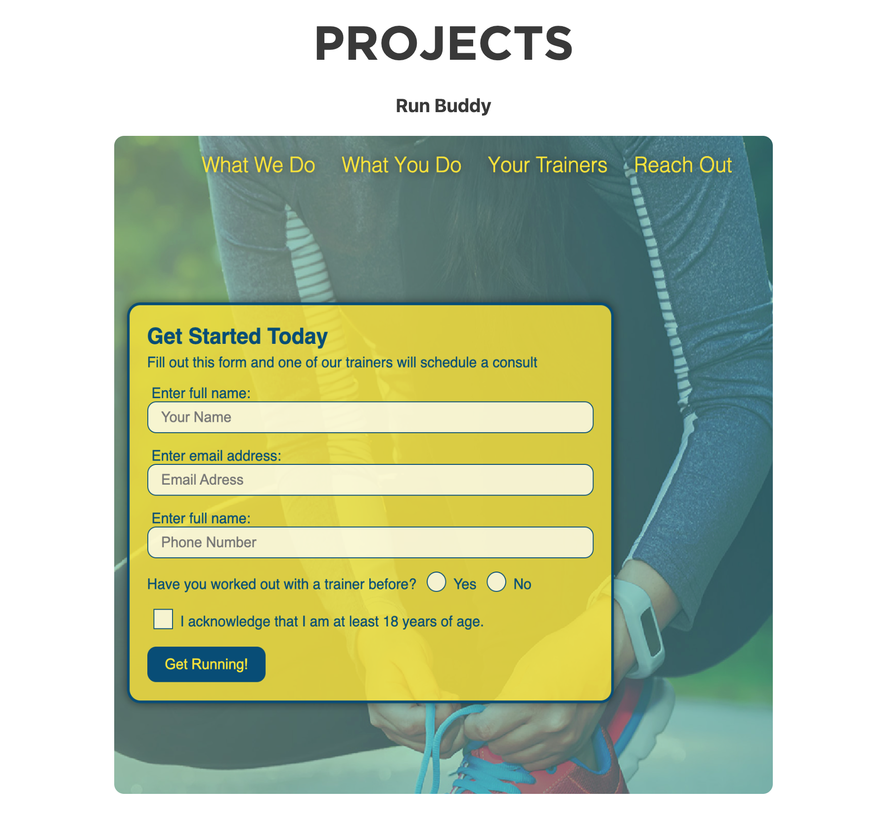
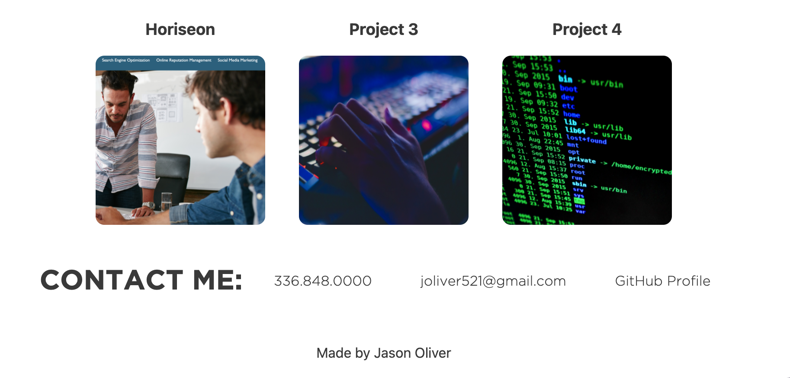
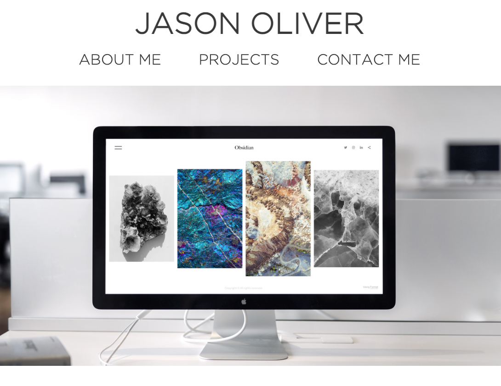
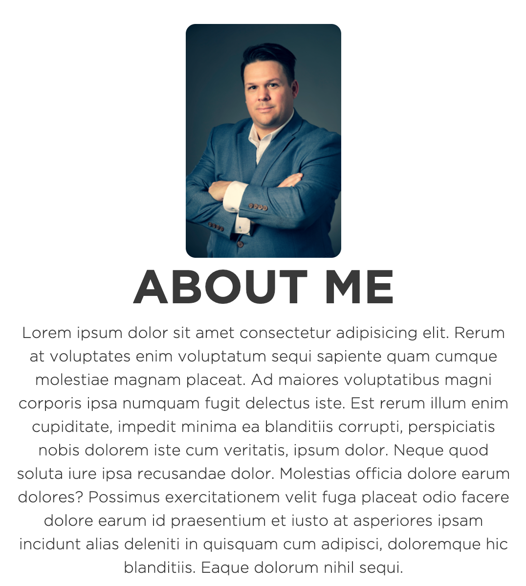
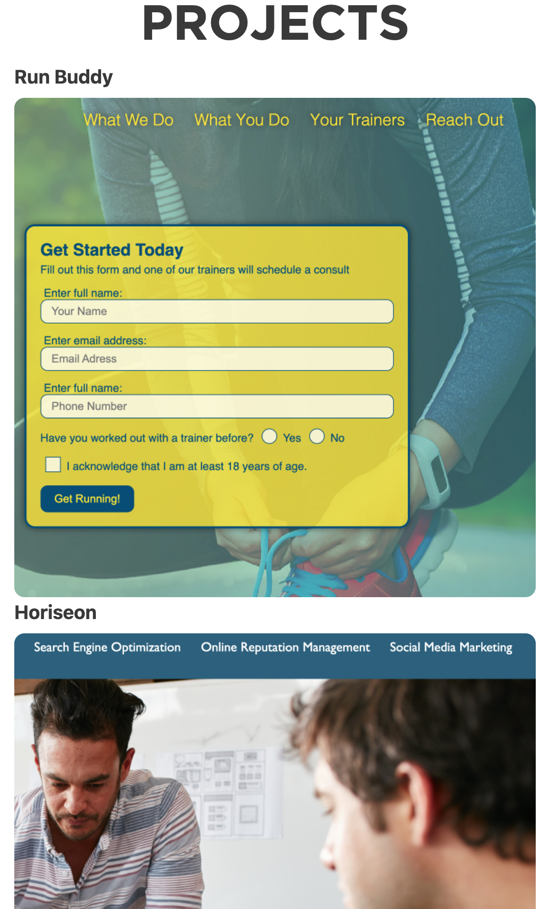
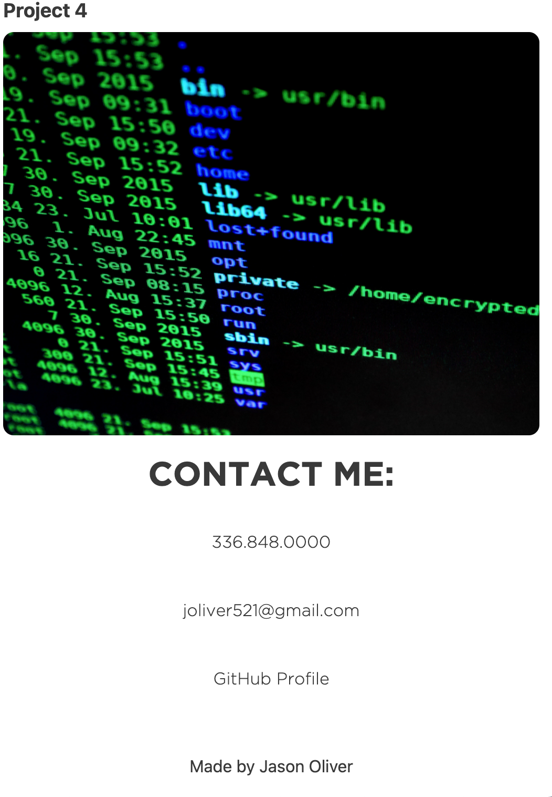

# Responsive Portfolio Site

A website showcasing my applications and abilities.

Layout and content were built using HTML and CSS using VS Code.

## Media Query for min-width 600

## Started the design of my site with mobile screen

## Reason 

* To show my abilities to code a responsive website. 
* Learn a little about me and my background.
* Projects section that will take clients to the deployed applications.
* An easy way for clients and potential clients to reach me.

## Contributions:

All images including the hero image and projects 3 & 4 place holder images were downloaded from Pexels.
* Hero image credit - Format
* Project 3/Password Generator image credit - Soumil Kumar
* Project 4 image credit - Pixbay

Robot favicon from favicon.io/emoji-favicons/

## GitHub repository for challenge 2
* [Github Repo](https://github.com/joliver521/portfolio)

## Live website for challenge 2
* [Live Portfolio website](https://joliver521.github.io/portfolio/)

